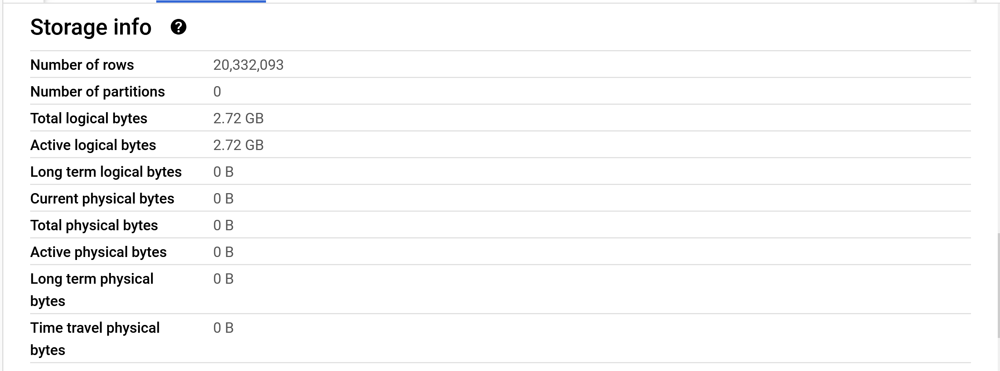
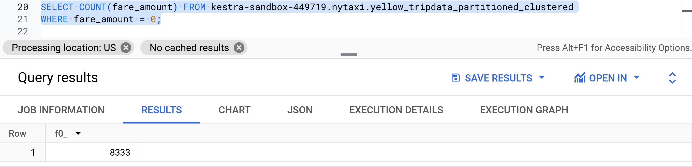

# Answers for module_3

## Question 1 

The following image shows the number of rows from the partitioned and clustered table:



Answer: 20,332,093

## Question 2
The following queries show the estimated amount when selected on the top right of the UI:

```SQL 
-- 0MB for external
SELECT COUNT(DISTINCT PULocationID) FROM kestra-sandbox-449719.nytaxi.external_yellow_tripdata;

-- 155.12MB for materialized
SELECT COUNT(DISTINCT PULocationID) FROM kestra-sandbox-449719.nytaxi.yellow_tripdata_partitioned_clustered;
```

Answer: 0 MB for the External Table and 155.12 MB for the Materialized Table.


## Question 3
Answer: BigQuery is a columnar database, and it only scans the specific columns requested in the query. Querying two columns (PULocationID, DOLocationID) requires reading more data than querying one column (PULocationID), leading to a higher estimated number of bytes processed.

Because, when scanning for multiple columns, it will search for all columns queried for each row it runs through.

## Question 4

The following image shows the query made to get the answer:



## Question 5

Answer: Partition by tpep_dropoff_datetime and Cluster on VendorID

Because it will create partitions of `tpep_dropoff_datetime` making it easy to query that column.

## Question 6
The following query shows the answer estimated cost value:
```SQL 
SELECT DISTINCT(VendorID) FROM kestra-sandbox-449719.nytaxi.yellow_tripdata_materialized
WHERE tpep_dropoff_datetime BETWEEN '2024-03-01' AND '2024-03-15';

SELECT DISTINCT(VendorID) FROM kestra-sandbox-449719.nytaxi.yellow_tripdata_partitioned_clustered
WHERE tpep_dropoff_datetime BETWEEN '2024-03-01' AND '2024-03-15';
```

Answer: 310.31 MB for non-partitioned table and 285.64 MB for the partitioned table

## Question 7

The data is stored in a GCP Bucket, when creating the external table, we need to add the location in the GCP Bucket to proceed.

Answer: GCP Bucket

## Question 8

Answer: False

Because, clustering data is recomended for a table with data size bigger than 1 GB, otherwise it can increase cost unecessary.